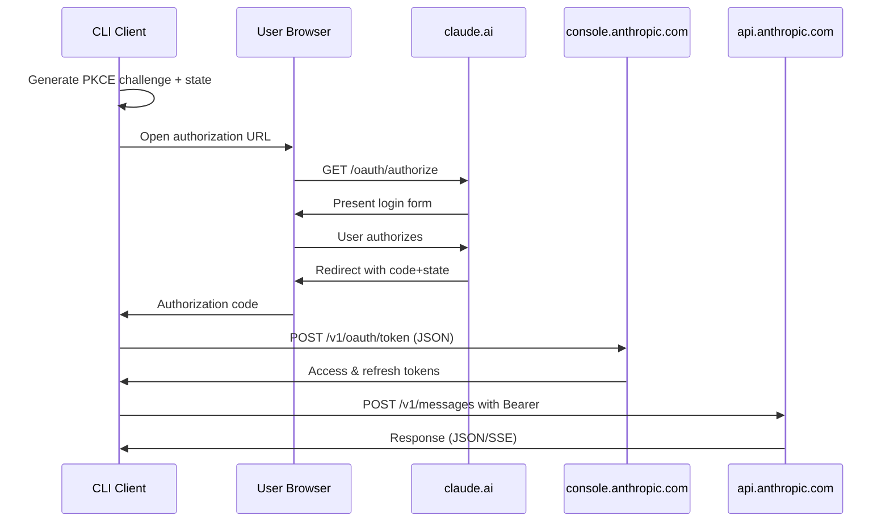

# Requirements — Claude Pro/Max OAuth with Local Callback Server

**Purpose**
Enable a desktop/CLI app to authenticate a Claude Pro/Max user via OAuth **with a loopback (localhost) callback**, obtain/refresh access tokens, and call the Anthropic Messages API using **Bearer** auth (no API key). Use **PKCE** (S256), exact‑match `redirect_uri`, and a small local HTTP server. RFC‑compliant loopback redirection and token handling are required. ([IETF Datatracker][1])

---

## 1) Scope and Goals

* **G1 — Sign‑in (local callback):** Open the system browser to the Anthropic authorize endpoint; receive `code`+`state` at `http://localhost:{port}/callback`; exchange for tokens. (Local server; no embedded webviews.) ([IETF Datatracker][1])
* **G2 — Token lifecycle:** Store `access_token` + `refresh_token`; auto‑refresh before expiry; recover on 401 if refresh plausible.
* **G3 — API access (OAuth):** Call `https://api.anthropic.com/v1/messages` with:

  * `Authorization: Bearer <ACCESS_TOKEN>`
  * `anthropic-version: 2023-06-01` (required)
  * `anthropic-beta: oauth-2025-04-20` (current OAuth requirement per Claude Code clients; vendor may change this)
    Do **not** send `x-api-key`. ([Anthropic][2], [Gist][3], [GitHub][4])
* **G4 — Fallbacks:** Manual “copy/paste code” flow, and optional *OAuth → Create API key* post‑step if your product needs API‑key mode later.
* **G5 — Security & UX:** PKCE (S256), CSRF‑safe `state`, exact `redirect_uri` validation; minimal, friendly UI in the browser tab that closes itself.

**Out of scope (for v1):** multi‑tenant workspace selection UI, token revocation endpoint (undocumented), BYO proxy autosetup.

---

## Constants (current)

- Client ID: `9d1c250a-e61b-44d9-88ed-5944d1962f5e`
- Default Redirect URI: `http://localhost:54545/callback` (CLI default)
- Scopes: `org:create_api_key user:profile user:inference`
- Authorization: `https://claude.ai/oauth/authorize`
- Token: `https://console.anthropic.com/v1/oauth/token`
- API Base: `https://api.anthropic.com`

Token format examples
- Access: `sk-ant-oat01-...` (typical TTL ~ 8 hours)
- Refresh: `sk-ant-ort01-...`

CLI quickstart
- Login: `zig build run -- auth login` (listens on 54545 by default)
- Override port: `zig build run -- auth login --port 12345`
- Status/Whoami/Logout: `zig build run -- auth status|whoami|logout`

---

## 2) Constraints & Assumptions

* **Client registration:** You have a client ID that is allowed to use loopback `redirect_uri` (e.g., `http://localhost:{port}/callback`). Authorization servers **must** allow arbitrary port on loopback per RFC 8252 §7.3; in practice, vendors may still require pre‑registration of the scheme/host/path. ([IETF Datatracker][1])
* **Loopback specifics:** Use `http://localhost:{port}/callback` exclusively. Exact match of `redirect_uri` is required (host + path); ports may vary if your registration allows any port. Do not use `127.0.0.1` or `[::1]` hosts in this project. The CLI default port is **54545**. ([IETF Datatracker][1])
* **Headers:** `anthropic-version` is always required. Beta headers are supported and used to gate features; today, OAuth tokens require `anthropic-beta: oauth-2025-04-20` (subject to change). ([Anthropic][2], [Gist][3])
* **Endpoints:**

  * Authorization: `https://claude.ai/oauth/authorize` (or `https://console.anthropic.com/oauth/authorize`)
  * Token: `https://console.anthropic.com/v1/oauth/token`
  * API: `https://api.anthropic.com/v1/messages`
    Authorize/token endpoints are vendor‑specific; treat them as change‑prone (monitor failures & surface actionable errors). (The Messages API path and version header are documented; OAuth usage of Bearer + beta header is observed in Claude Code clients.) ([Anthropic][5], [Gist][3], [GitHub][4])
* **Scopes (from your flow):** `org:create_api_key user:profile user:inference`. Treat as vendor‑defined; fail gracefully if scope changes.
* **Credential storage (required):** OAuth credentials must be stored in and retrieved from `~/.local/share/{agent name}/auth.json`. This is the single canonical location used by agents and the foundation auth wiring.

---

## 2.5) Sequence (happy path)



---

## 3) User Stories

* **U1**: As a Pro/Max user, I can log in via browser and land back in the app without copy‑pasting any code.
* **U2**: As a user, my session persists across restarts; the app silently refreshes tokens.
* **U3**: As a user, requests to Claude models succeed with Bearer auth and the correct headers.
* **U4**: As a user behind a corporate proxy, I can complete auth if my browser can reach the provider; the local callback still works. (Network docs/UX should call out proxy pitfalls.) ([GitHub][6])
* **U5**: As a user, on failure (e.g., OAuth temporarily unsupported) I get a clear message and a fallback path. ([GitHub][7])

---

## 4) Detailed Functional Requirements

### 4.1 Authorization Flow (PKCE + loopback)

* **F1** Generate PKCE: random 32–64 byte verifier; S256 challenge.
* **F2** Generate a **separate** high‑entropy `state`. Do **not** reuse the PKCE verifier as `state`. ([IETF Datatracker][1])
* **F3** Start a local HTTP server bound to the loopback interface on a chosen port (default **54545**); path `/callback`.
* **F4** Build authorize URL:

  * `response_type=code`
  * `client_id=<CLIENT_ID>`
  * `redirect_uri=http://localhost:{port}/callback`
  * `scope=org:create_api_key user:profile user:inference`
  * `code_challenge=<S256>` & `code_challenge_method=S256`
  * `state=<opaque>`
* **F5** Open in system browser; disallow embedded webviews. ([IETF Datatracker][1])
* **F6** Callback handler: read `code` + `state` **from query string**; verify `state` **and** the exact `redirect_uri` you used (`http://localhost:{port}/callback`). Return a minimal HTML page that autocloses. ([IETF Datatracker][1])
* **F7** Token exchange (JSON): POST `https://console.anthropic.com/v1/oauth/token` with body:

  ```json
  {
    "grant_type": "authorization_code",
    "client_id": "9d1c250a-e61b-44d9-88ed-5944d1962f5e",
    "code_verifier": "<PKCE_VERIFIER>",
    "code": "<CODE>",
    "redirect_uri": "http://localhost:54545/callback",
    "state": "<STATE>"
  }
  ```

  Use `Content-Type: application/json` and `Accept: application/json`. The server may return a compressed body; clients must honor `Content-Encoding` (gzip/deflate/zstd) and decompress before JSON parsing.
* **F8** Persist tokens & absolute expiry (`now + expires_in`).

  - Persist to JSON at `~/.local/share/{agent name}/auth.json` and reload from the same path on startup/refresh.

### 4.2 Token Refresh

* **F9** Background refresh when `now >= (expires_at - skew)`, where `skew` ≈ 60–120s.
* **F10** On API 401 with `authentication_error`, attempt one refresh (if refresh token present, and last refresh >30s ago).
* **F11** Refresh request: POST token endpoint (JSON) `{ "grant_type": "refresh_token", "refresh_token": "...", "client_id": "9d1c250a-e61b-44d9-88ed-5944d1962f5e" }`. Accept JSON; handle compressed responses.
* **F12** Update stored token set atomically; keep last‑good tokens until swap succeeds.

### 4.3 API Wrapper (Messages)

* **F13** All Anthropic API calls must include:

  * `Authorization: Bearer <ACCESS_TOKEN>`
  * `anthropic-version: 2023-06-01`
  * `anthropic-beta: oauth-2025-04-20` (and any feature betas your app uses)
    Remove/forbid `x-api-key`. Requests hit `https://api.anthropic.com/v1/messages`. ([Anthropic][2], [Gist][3])
* **F14** Streaming uses `Accept: text/event-stream` and `stream: true` in body.
* **F15** Surface model/feature errors verbosely; include Request ID from headers if present.

### 4.4 Storage & Configuration

* **F16** Secrets at rest: store tokens in OS keychain (macOS Keychain, Windows Credential Manager, Linux Secret Service/libsecret).
* **F17** Config file (non‑secret): client\_id, scopes, default models, beta flags, telemetry toggle.
* **F18** Environment vars (optional): `ANTHROPIC_OAUTH_CLIENT_ID`, `ANTHROPIC_SCOPES`, `ANTHROPIC_BETA`.
* **F19** Logging must never print tokens; scrub `Authorization` and any `refresh_token` in payloads.

### 4.5 Fallbacks

* **F20** **Manual code flow**: show an authorize URL and prompt the user to paste `code#state`. Use same token exchange logic (exact `redirect_uri` must match what was sent).
* **F21** **API‑key path (optional):** After OAuth, optionally call the “create API key” helper if enabled by scopes, then switch to key auth for long‑running servers. (Undocumented/subject to change—treat as optional and guarded.)

---

## 5) Security Requirements

* **S1** PKCE S256 **mandatory**; reject non‑S256. ([IETF Datatracker][1])
* **S2** Verify `state` and **exact** `redirect_uri` (defend against mix‑up). ([IETF Datatracker][1])
* **S3** Bind server to the loopback interface only. Do not hardcode a specific host; the `redirect_uri` host will be `localhost`. ([IETF Datatracker][1])
* **S4** Open socket just‑in‑time; close after handling the first valid response. ([IETF Datatracker][1])
* **S5** CSRF: require `state` match and reject duplicates/replays. ([IETF Datatracker][1])
* **S6** Token storage: encrypt via OS keychain; zero out in memory when replaced.
* **S7** Telemetry: opt‑in; never transmit tokens, codes, or PII.

---

## 6) Error Handling & UX

* **E1** Browser failed to open → display the URL for manual copy, keep server running, poll for callback for N minutes.
* **E2** Port busy → retry up to 5 random ports; display chosen URL.
* **E3** Callback received invalid/missing `state` → show “Login failed (state mismatch).” Offer retry. ([IETF Datatracker][1])
* **E4** 400/401 on token exchange → show upstream error JSON; suggest retry or manual flow.
* **E5** API 401 “OAuth not supported / revoked” → show a diagnostic with suggestions (re‑login, try API‑key path if available). ([GitHub][7])
* **E6** Corporate proxy shenanigans → document that auth uses the **system browser**; if the browser can reach Anthropic, the loopback callback should still land; only the final API calls need your app’s outbound connectivity. Provide proxy config flags. ([GitHub][6])

---

## 7) Non‑Functional Requirements

* **Reliability:** 99.9% success for login+callback under normal user network; retries on transient failures (3x with backoff).
* **Performance:** First‑time auth completes within <30s; token refresh within <3s.
* **Portability:** macOS, Windows, Linux; no admin privileges.
* **Observability:**

  * Structured logs with levels; `--debug` reveals request metadata **excluding** secrets.
  * Counters: token refresh success/failure, API 401s, auth round‑trip time.
  * Trace hook: capture upstream `request-id` when present.

---

## 8) Testing & Acceptance

* **Unit:** PKCE generator; state generator; redirect URI validation; token store; header builder.
* **Integration:**

  * **Happy path:** login → API call → refresh → API call.
  * **Edge:** port conflict, invalid state, expired refresh, network timeout.
  * **Headers:** assert `Authorization` present, `anthropic-version` present, **no** `x-api-key`, beta header included. ([Anthropic][2])
* **E2E:** On macOS/Windows/Linux CI, open a headless or real browser to complete the flow (use a mock IdP if vendor E2E isn’t feasible).
* **Manual:** Corporate proxy scenario; IPv6‑only host; default browser switched mid‑flow.

**Acceptance Criteria (sample cURL):**

```bash
# Token exchange succeeds (200, JSON contains access_token & refresh_token)
curl -sS https://console.anthropic.com/v1/oauth/token \
  -H 'Content-Type: application/json' -H 'Accept: application/json' \
  -d '{"grant_type":"authorization_code","code":"...","state":"...","client_id":"9d1c250a-e61b-44d9-88ed-5944d1962f5e","redirect_uri":"http://localhost:54545/callback","code_verifier":"..."}'

# API call with Bearer, version, and beta header returns 200 and content
curl -sS https://api.anthropic.com/v1/messages \
 -H "Authorization: Bearer <ACCESS_TOKEN>" \
 -H "Content-Type: application/json" \
 -H "anthropic-version: 2023-06-01" \
 -H "anthropic-beta: oauth-2025-04-20" \
 -d '{"model":"claude-sonnet-4-20250514","max_tokens":64,"messages":[{"role":"user","content":"ping"}]}'
```

(Version header is required per docs; beta header reflects current OAuth behavior in Claude Code clients.) ([Anthropic][2], [Gist][3])

---

## 9) Risks, Trade‑offs, Alternatives

* **Vendor churn:** OAuth headers/endpoints can change (beta flag especially). Mitigation: feature‑flag the beta header; show precise upstream error text. ([Anthropic][8])
* **Plan restrictions:** Some plan tiers / environments intermittently report “OAuth not supported” → keep API‑key fallback. ([GitHub][7])
* **Local firewall / browser quirks:** Use `localhost`; ensure it resolves to the loopback interface. Avoid forcing `127.0.0.1`. ([IETF Datatracker][1])
* **Security:** Reusing PKCE verifier as `state` weakens CSRF defense. Require separate random `state`. ([IETF Datatracker][1])
* **Proxy environments:** Auth uses the browser path; API calls need app‑level proxy config; document env vars like `HTTP_PROXY/HTTPS_PROXY/NO_PROXY`. ([GitHub][6])
* **Client registration host/port mismatch (observed 2025‑09‑01):** After switching the `redirect_uri` host from `localhost` to `127.0.0.1`, the browser showed: `Redirect URI http://127.0.0.1:8081/callback is not supported by client.` We have also observed the same error on historical defaults like `http://127.0.0.1:8080/callback`. We did not get this message when using the localhost form `http://localhost:{port}/callback` (repo default is now `http://localhost:54545/callback`). This indicates our OAuth client registration is for the `localhost` host only. Actions:
  - Use `http://localhost:{port}/callback` exclusively. If your registration previously included `127.0.0.1`, update it to `localhost` instead.

**Alternatives:**

* **Custom URL scheme** (mobile‑style) → more setup, weaker portability; RFC prefers loopback on desktops. ([IETF Datatracker][1])
* **Device code flow** → simpler UX for headless but **not** known to be supported for this provider.

---

## 10) Implementation Outline (reference)

* **Modules:** `auth/loopback_server`, `auth/pkce`, `auth/authorize_url`, `auth/token_client`, `auth/store`, `api/http_client`.
* **Sequence (happy path):**

  1. `pkce := generate()` → `state := random()` → `srv := listen(loopback:0)`
  2. `redirect_uri := http://localhost:{port}/callback`
  3. `open(authorize_url(pkce.challenge, state, redirect_uri))`
  4. `srv.waitFor(code,state)` → verify state & redirect\_uri → `tokenClient.exchange(...)`
  5. `store.save(tokens)` → `apiClient := withBearer(tokens.access)`
  6. periodic `refreshIfNeeded()`; on 401 try refresh once.

---

## 11) Deliverables

* Minimal CLI with commands: `login`, `status`, `logout`, `whoami`, `test-call`.
* Library package exporting: `loginWithLoopback()`, `getAccessToken()`, `fetchWithAnthropicOAuth()`.
* Docs: README with flows, proxy notes, and troubleshooting.
* Tests: unit + integration + E2E recipes.

---

## 12) Open Questions

* Will we ship the optional “create API key after OAuth” path? (Depends on product needs.)
* Do we need workspace selection or any extra scopes beyond `user:inference`?
* Should we persist per‑model beta flags or feature‑detect dynamically?

---

### Next steps

1. Register/confirm a **client ID** that allows loopback `redirect_uri`.
2. Implement the loopback server + PKCE + state validation exactly as above.
3. Ship the header‑correct **Bearer** wrapper with a feature flag for the OAuth beta header.
4. Build the test matrix: macOS/Windows/Linux, IPv4/IPv6, with/without proxy.
5. Wire structured logs and a clean fallback to manual code flow and/or API‑key mode.

---

### Appendix: OpenAPI Summary (reference)

- `GET https://claude.ai/oauth/authorize` (security: none)
  - Query: `client_id`, `response_type=code`, `redirect_uri`, `scope`, `code_challenge`, `code_challenge_method=S256`, `state`.
- `POST https://console.anthropic.com/v1/oauth/token` (security: none)
  - Headers: `Content-Type: application/json`, `Accept: application/json`.
  - Body: `{ grant_type, code, redirect_uri, client_id, code_verifier, state }` for authorization_code; `{ grant_type, refresh_token, client_id }` for refresh.
  - Response: JSON `{ token_type, access_token, expires_in, refresh_token, scope, organization?, account? }`.
- `GET https://api.anthropic.com/api/oauth/profile` (with Bearer)
- `GET https://api.anthropic.com/api/oauth/claude_cli/roles` (with Bearer)
- `POST https://api.anthropic.com/v1/messages` (with Bearer)
  - Headers: `anthropic-version: 2023-06-01`, optional `anthropic-beta: oauth-2025-04-20`.
  - Body: `{ model, max_tokens, messages, stream?, metadata? }`.

[1]: https://datatracker.ietf.org/doc/html/rfc8252 "
            
                RFC 8252 - OAuth 2.0 for Native Apps
            
        "
[2]: https://docs.anthropic.com/en/api/versioning?utm_source=chatgpt.com "Versions"
[3]: https://gist.github.com/changjonathanc/9f9d635b2f8692e0520a884eaf098351?utm_source=chatgpt.com "Anthropic OAuth CLI - Simplified Claude Code spoof demo"
[4]: https://github.com/sst/opencode/issues/417?utm_source=chatgpt.com "How does opencode work with Claude Code OAuth tokens ..."
[5]: https://docs.anthropic.com/en/api/messages?utm_source=chatgpt.com "Messages"
[6]: https://github.com/anthropics/claude-code/issues/1382 "[BUG] - Unable to connect to Anthropic services - behind corporate proxy · Issue #1382 · anthropics/claude-code · GitHub"
[7]: https://github.com/anthropics/claude-code/issues/5956?utm_source=chatgpt.com "OAuth Authentication Not Supported for Highest Plan Tier"
[8]: https://docs.anthropic.com/en/api/beta-headers?utm_source=chatgpt.com "Beta headers"
